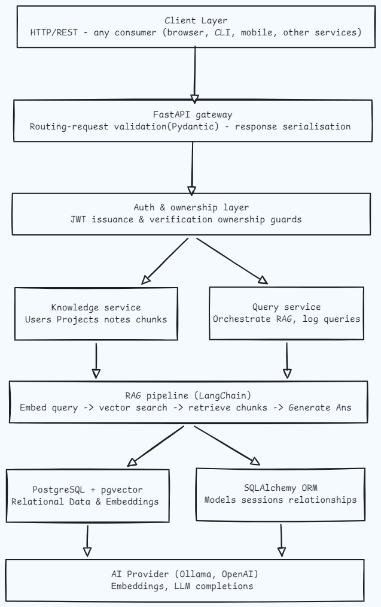

# Knowladge Vault

## About
- FastAPI based backend application where multiple users can sign up, login, and manage their own knowladge collections.
- Each user can create projects, upload and organize notes within those projects, and query their data using RAG pipeline

## Architecture
### High level architecture

### Databse schema 

#### Some Design decisions 
1. Why `NoteChunk` and `Embedding` are separate tables?
    - A Note can be thousands of words. LLMs and vector similarity work best on small, focused chunks. So we split a note into chunks, then embed each chunk.
    - Embedding is its own table because we might want to re-embedded using a different model later without touching the chunck content
2. Why `QueryLog` has both `user_id` and `project_id`?
    - a user only ever queries within a project's scope, but we want to answer "how many queries  did this user make?" and "which projects get queried most?" separately. 
3. Why UUIDs instead of integerIDs?
    - in a multi-tanent system, sequntial integers leak information. UUIDs are opaque
    